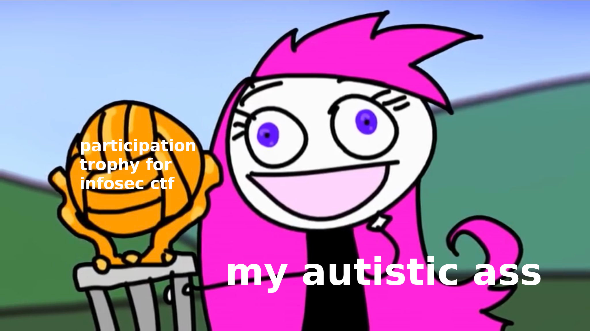

## Programming

Here is where I do coding puzzles and competitive programming. Check out this section's [README.md file](./programming/README.md).

Profiles re. coding puzzles and competitive programming: [HackerRank](https://www.hackerrank.com/hackermaneia), [CodeSignal](https://app.codesignal.com/profile/alexande1224), [Coderbyte](https://coderbyte.com/profile/EntropyThot), [Topcoder](https://www.topcoder.com/members/LambdaCalculus), [Edabit](https://edabit.com/user/PDK3Bb98sENmo5wnT) and [Project Lovelace](https://projectlovelace.net/users/EpsilonCalculus/)

## Infosec

I also like to do a number of cybersecurity focused capture the flags (hence the name of this repo). Check out this section's [README.md file](./infosec/README.md).

Profiles re. InfoSec CTFs: [W3challs](https://w3challs.com/profile/EntropyThot) and [ringzer0ctf](https://ringzer0ctf.com/profile/36667/EntropyThot)

